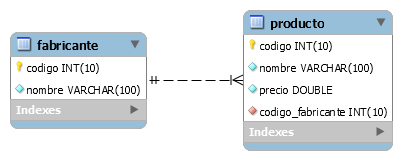

### Abrir el script de la base de datos llamada “tienda.sql” y ejecutarlo para crear sus tablas e insertar datos en las mismas.
A continuación, generar el modelo de entidad relación. Deberá obtener un diagrama de entidad relación igual al que se muestra a continuación:

#### A continuación, se deben realizar las siguientes consultas sobre la base de datos:

1. Lista el nombre de todos los productos que hay en la tabla producto.
2. Lista los nombres y los precios de todos los productos de la tabla producto.
3. Lista todas las columnas de la tabla producto.
4. Lista los nombres y los precios de todos los productos de la tabla producto, redondeando el valor del precio.
5. Lista el código de los fabricantes que tienen productos en la tabla producto.
6. Lista el código de los fabricantes que tienen productos en la tabla producto, sin mostrar los repetidos.
7. Lista los nombres de los fabricantes ordenados de forma ascendente.
8. Lista los nombres de los productos ordenados en primer lugar por el nombre de forma ascendente y en segundo lugar por el precio de forma descendente.
9. Devuelve una lista con las 5 primeras filas de la tabla fabricante.
10. Lista el nombre y el precio del producto más barato. (Utilice solamente las cláusulas `ORDER BY` y `LIMIT`)
11. Lista el nombre y el precio del producto más caro. (Utilice solamente las cláusulas `ORDER BY` y `LIMIT`)
12. Lista el nombre de los productos que tienen un precio menor o igual a $120.
13. Lista todos los productos que tengan un precio entre $60 y $200. Utilizando el operador `BETWEEN`.
14. Lista todos los productos donde el código de fabricante sea 1, 3 o 5. Utilizando el operador `IN`.
15. Devuelve una lista con el nombre de todos los productos que contienen la cadena "Portátil" en el nombre.

### Consultas Multitabla:

16. Devuelve una lista con el código del producto, nombre del producto, código del fabricante y nombre del fabricante, de todos los productos de la base de datos.
17. Devuelve una lista con el nombre del producto, precio y nombre de fabricante de todos los productos de la base de datos. Ordene el resultado por el nombre del fabricante, por orden alfabético.
18. Devuelve el nombre del producto, su precio y el nombre de su fabricante, del producto más barato.
19. Devuelve una lista de todos los productos del fabricante Lenovo.
20. Devuelve una lista de todos los productos del fabricante Crucial que tengan un precio mayor que $200.
21. Devuelve un listado con todos los productos de los fabricantes Asus, Hewlett-Packard. Utilizando el operador `IN`.
22. Devuelve un listado con el nombre de producto, precio y nombre de fabricante, de todos los productos que tengan un precio mayor o igual a $180. Ordene el resultado en primer lugar por el precio (en orden descendente) y en segundo lugar por el nombre (en orden ascendente).

### Consultas Multitabla

#### Resuelva todas las consultas utilizando las cláusulas `LEFT JOIN` y `RIGHT JOIN`:

23. Devuelve un listado de todos los fabricantes que existen en la base de datos, junto con los productos que tiene cada uno de ellos. El listado deberá mostrar también aquellos fabricantes que no tienen productos asociados.
24. Devuelve un listado donde sólo aparezcan aquellos fabricantes que no tienen ningún producto asociado.

### Subconsultas (En la cláusula `WHERE`)

#### Con operadores básicos de comparación:

25. Devuelve todos los productos del fabricante Lenovo. (Sin utilizar `INNER JOIN`).
26. Devuelve todos los datos de los productos que tienen el mismo precio que el producto más caro del fabricante Lenovo. (Sin utilizar `INNER JOIN`).
27. Lista el nombre del producto más caro del fabricante Lenovo.
28. Lista todos los productos del fabricante Asus que tienen un precio superior al precio medio de todos sus productos.

### Subconsultas con `IN` y `NOT IN`:

29. Devuelve los nombres de los fabricantes que tienen productos asociados. (Utilizando `IN` o `NOT IN`).
30. Devuelve los nombres de los fabricantes que no tienen productos asociados. (Utilizando `IN` o `NOT IN`).

### Subconsultas (En la cláusula `HAVING`):

31. Devuelve un listado con todos los nombres de los fabricantes que tienen el mismo número de productos que el fabricante Lenovo.

### Importante para la entrega:
- El formato puede ser en (.docx), (.pdf) o (.sql)
- La entrega es a través de mail al correo jnicolas.ramos10@gmail.com, y el asunto debe
- respetar este formato:
TP_MYSQL(DML)_7mo1ra_esc728 – <nombre de los integrantes>
